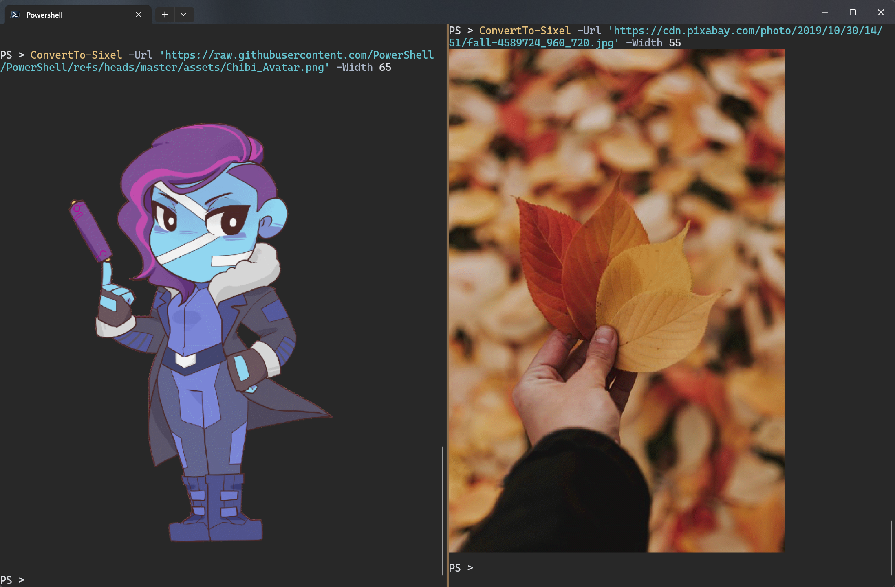
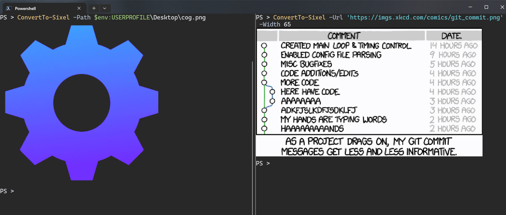

# Sixel

A module that lets you convert images to Sixel, Inline Images Protocol, Kitty Graphics Protocol.  

Supports converting bmp, gif, jpeg, pbm, png, tiff, tga, webp to sixel.  

## Install

```powershell
Install-Module Sixel
# or
Install-PSResource Sixel
```

## Requirements

This module supports Powershell version 5.1 & 7.4.  
Windows Terminal supports Sixel from version 1.22.  

There is an example sixel file in the ./assets folder that can be used for testing  

```powershell
# test sixel
Invoke-RestMethod https://raw.githubusercontent.com/trackd/Sixel/refs/heads/main/assets/chibi.six
```

## Authors

**[@trackd](https://github.com/trackd)**  
**[@ShaunLawrie](https://github.com/ShaunLawrie)**  

## Libraries

- [Sixlabors.Imagesharp](https://github.com/SixLabors/ImageSharp) [Apache2.0](https://github.com/SixLabors/ImageSharp/blob/main/LICENSE)  

- [NAudio](https://github.com/naudio/NAudio) [MIT](https://github.com/naudio/NAudio?tab=MIT-1-ov-file)  

## ALC

[PowerShell-ALC](https://github.com/jborean93/PowerShell-ALC)  

## examples

  
  
